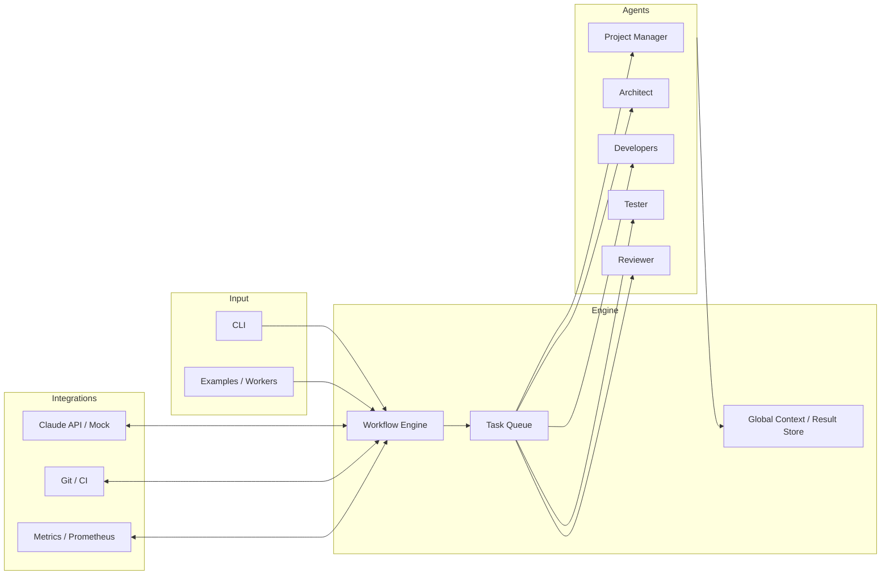

# AIAgent Dev Studio

> English version: `README_EN.md`

## 项目简介
- 一个基于 Claude API 的多 Agent 自动化工作室，用 AI 团队完成从需求到发布的全流程开发。
- AIAgent-Dev-Studio 将需求分析、架构设计、代码生成、测试与审查拆分给不同的智能 Agent，通过任务队列、质量门禁和监控指标保证交付质量，同时提供 Mock/真实 API、Docker 与 Cloudflare Workers 友好的集成，帮助个人和团队快速验证想法或演示工程化能力。

## 技术亮点
1. **Cloudflare Workers Ready**：HTTP/metrics 端点 + Webhook 适配器，让 orchestrator 可以被 Cloudflare Workers 边缘触发，适合在全球节点调度任务或自动响应事件。
2. **Claude API 深度集成**：异步客户端、指数重试/熔断、动态模型配置和 Mock 模式，既能连官方 API，也能在离线模式复现流程。
3. **Multi-Agent 协作**：项目经理、架构师、开发者、测试员、审查员等 Agent 模块化设计，可按需裁剪或扩展前端/后端/文档/部署等子 Agent。

## 架构图 (Mermaid)


## 架构图 (ASCII)
```
┌──────────────┐     ┌──────────────┐
│ User / CLI   │ ──> │ Workflow     │
│ Cloudflare   │     │ Engine       │
└──────┬───────┘     └──────┬───────┘
       │                    │
       │            ┌───────▼───────┐
       │            │   Task Queue  │
       │            └───────┬───────┘
       │        ┌───────────┴───────────┐
       └──────> │ PM / Arch / Dev / QA /│
                │ Reviewer Agents       │
                └───────────┬───────────┘
                            │
                  ┌─────────▼─────────┐
                  │ Claude API / Mock │
                  │ Git / CI / Metric │
                  └───────────────────┘
```


## 使用方法
1. **克隆与安装**
   ```bash
   git clone <repository-url>
   cd AIAgent
   cp .env.example .env        # 填入真实 CLAUDE_API_KEY 或启用 USE_MOCK_API
   pip install -r requirements.txt
   ```
2. **快速体验**
   ```bash
   python run_example.py
   # 或者
   python main.py --title "任务管理系统" \
                  --description "一个支持协作的 Web 应用" \
                  --features "用户管理" "任务流转" \
                  --tech-stack "Python" "FastAPI" "SQLite"
   ```
3. **脚本 / API 复用**
   ```python
   import asyncio
   from multi_agent_dev import MultiAgentDevSystem
   
   async def run():
       system = MultiAgentDevSystem()
       await system.initialize()
       await system.develop_project(
           title="博客系统",
           description="一个支持评论与标签的博客",
           features=["文章管理", "评论", "标签"],
           tech_stack=["Python", "FastAPI", "PostgreSQL"]
       )
   
   asyncio.run(run())
   ```
4. **Cloudflare Workers / Webhook**：将 `main.py` 暴露的 `/health`、`/metrics` 端点接入 Cloudflare Workers，或通过 Workers 代理 CLI 请求，即可在边缘触发自动化工作流。
5. **运行测试与工具**
   ```bash
   pytest tests -q
   python scripts/health_check.py
   make docker-run        # optional docker workflow
   ```

## 配置速览
| 变量 | 说明 | 默认值 |
| --- | --- | --- |
| `CLAUDE_API_KEY` | Claude API 密钥 | 必填 |
| `CLAUDE_BASE_URL` | API 网关 | `https://api.anthropic.com` |
| `USE_MOCK_API` | 启用模拟客户端 | `false` |
| `LOG_LEVEL` / `MAX_RETRIES` | 运行参数 | `INFO` / `3` |
| `METRICS_ENABLED` | 暴露 `/health` `/metrics` | `true` |

更多选项请参考 `config.py` 与 `.env.example`。

## 故障排除
1. **API 调用失败**：检查密钥/网络，或运行 `python scripts/health_check.py`。
2. **任务堆积**：查看 `logs/multi_agent_dev.log` 与 `TaskQueue.get_queue_status()`。
3. **Docker 健康检查异常**：确保容器内访问 `http://localhost:8000/health` 正常。

## 🌟 项目价值

- **端到端交付提速**：内置工作流引擎与多 Agent 协同，让需求拆解、编码、测试和评审保持闭环，显著压缩从创意到上线的周期。
- **真实环境可靠性**：同一套配置即可在本地、Docker 与 Cloudflare Workers 间切换，Mock/真实 Claude API 自由切换，确保方案在生产约束下验证通过。
- **团队知识沉淀**：标准化的配置、日志与指标让最佳实践易于复制，也为自定义 Agent、CI/CD 与观测拓展留出空间。

## 贡献与路线

1. Fork & 创建分支 → `make ci` → 提交 PR。
2. 可选方向：更多 Agent 模板、Cloudflare Workers 样例、OpenAI/Gemini 多模型支持。

## 许可证 & 文档
- MIT License （见 `LICENSE`）。
- 推荐阅读：`docs/PROJECT_SUMMARY.md`、`docs/API_REFERENCE.md`、`docs/DEPLOYMENT_GUIDE.md`。
