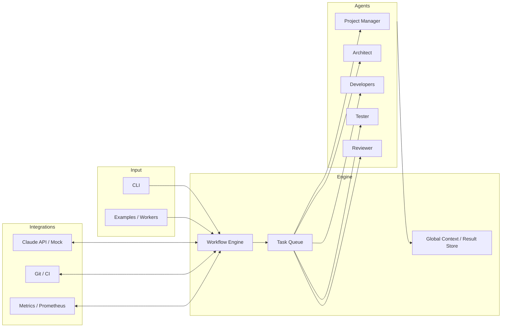

# AIAgent Dev Studio

> 中文版（Chinese version）请查看 `README.md`

## Project Overview
- A single CLI-driven multi-agent development studio that orchestrates Claude API powered agents from requirement discovery all the way to deployment validation.
- The system focuses on architecture design, code generation, documentation, testing, and review. It keeps prompts consistent through workflow templates, offers both Mock and real Claude API modes, and runs equally well on local machines, Docker, or Cloudflare Workers so teams can prove ideas quickly.

## Key Capabilities
1. **Cloudflare Workers Ready**: HTTP endpoints for `/health`, `/metrics`, and webhooks make it straightforward to drop the orchestrator into Workers or other edge runtimes while keeping automation hooks intact.
2. **Claude API First-Class Support**: Async client, structured prompts, retry/backoff logic, streaming, and Mock mode ensure the same workflow operates with Anthropic’s official API or offline simulations.
3. **Multi-Agent Collaboration**: Opinionated agent profiles (PM, architect, developers, QA, reviewer) let teams extend or swap personas to cover frontend, backend, docs, security, or any other specialty.

## Architecture (Mermaid)


## Architecture (ASCII)
```
┌──────────────────────┐      ┌──────────────────────────────┐
│ User / CLI & Workers │ ───> │        Workflow Engine        │
└──────────────────────┘      └──────────────────────────────┘
           │                          │
           │             ┌────────────────────────────┐
           │             │        Task Queue          │
           │             └────────────────────────────┘
           │        ┌────────────────────────────────────────┐
           └──────> │ PM / Arch / Dev / QA / Reviewer Agents │
                    └────────────────────────────────────────┘
                                  │
                     ┌──────────────────────────────────────┐
                     │ Claude API / Mock · Git / CI · Logs  │
                     └──────────────────────────────────────┘
```

## Usage
1. **Clone & Install**
   ```bash
   git clone <repository-url>
   cd AIAgent
   cp .env.example .env        # fill CLAUDE_API_KEY or set USE_MOCK_API=true
   pip install -r requirements.txt
   ```
2. **Quick Run**
   ```bash
   python run_example.py
   # Custom run
   python main.py --title "Collaboration System" \
                  --description "A web app that supports multi-role workflows" \
                  --features "User Portal" "Approval Flow" \
                  --tech-stack "Python" "FastAPI" "SQLite"
   ```
3. **Script / API Usage**
   ```python
   import asyncio
   from multi_agent_dev import MultiAgentDevSystem

   async def run():
       system = MultiAgentDevSystem()
       await system.initialize()
       await system.develop_project(
           title="Workflow System",
           description="Tracks contracts with digital signature support",
           features=["Timeline", "Chat", "Tagging"],
           tech_stack=["Python", "FastAPI", "PostgreSQL"]
       )

   asyncio.run(run())
   ```
4. **Cloudflare Workers / Webhook**: `main.py` exposes `/health` and `/metrics`. Wire Workers to relay CLI requests or trigger workflows from edge events to keep remote automation in sync.
5. **Diagnostics & Tooling**
   ```bash
   pytest tests -q
   python scripts/health_check.py
   make docker-run        # optional docker workflow
   ```

## Configuration
| Variable | Description | Default |
| --- | --- | --- |
| `CLAUDE_API_KEY` | Anthropic Claude API key | _required_ |
| `CLAUDE_BASE_URL` | API base URL | `https://api.anthropic.com` |
| `USE_MOCK_API` | Toggle mock transport | `false` |
| `LOG_LEVEL` / `MAX_RETRIES` | Logging detail & retries | `INFO` / `3` |
| `METRICS_ENABLED` | Expose `/health` `/metrics` | `true` |

See `config.py` and `.env.example` for the full list.

## Troubleshooting
1. **API Call Failures**: Verify the key/base URL, or run `python scripts/health_check.py`.
2. **Task Queue Stalls**: Inspect `logs/multi_agent_dev.log` and `TaskQueue.get_queue_status()` output.
3. **Docker Runtime Issues**: Ensure the orchestrator answers at `http://localhost:8000/health` and ports are not blocked.

## Project Value
- **Faster end-to-end delivery**: Workflow engine plus role-based agents keep discovery, coding, QA, and review in one loop so ideas launch faster.
- **Production-grade reliability**: Switch between local, Docker, and Cloudflare Workers setups, and toggle mock/real Claude APIs to validate behavior under real constraints.
- **Shared organizational memory**: Opinionated configs, logs, and metrics make wins repeatable while leaving room for custom agents, CI/CD hooks, and observability add-ons.

## Roadmap
1. Fork the repo, create a feature branch, run `make ci`, then open a PR.
2. Focus areas: richer agent templates, stronger Cloudflare Workers automation, and broader model support (Anthropic, OpenAI, Gemini, etc.).

## License & Docs
- MIT License in `LICENSE`.
- Recommended reading: `docs/PROJECT_SUMMARY.md`, `docs/API_REFERENCE.md`, `docs/DEPLOYMENT_GUIDE.md`.
